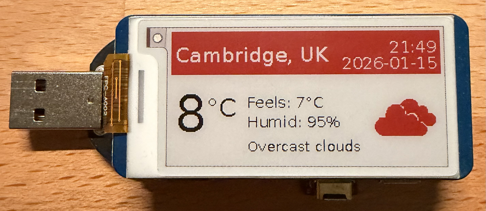

# `weather-dash`



A minimal, always-on weather dashboard for **e-paper**, designed for very low power usage.

The project fetches current weather from OpenWeather, renders a custom black/red/white dashboard image, and displays it on a Waveshare e-Paper HAT.

---

## Hardware

- [**Raspberry Pi Zero 2W**](https://thepihut.com/products/raspberry-pi-zero-2?srsltid=AfmBOootLvdn07v7_yWVf4S9StgBwjaNz1lXNhFWtnTeNFNJfn5xvyxv)
- **Waveshare 2.13" ePaper Display HAT (B)**  
  Red / Black / White, 250×122  
  SKU: WAV-13448
- **Pi Zero Dongle** (for simple USB power)

---

## Software overview

The project is split into three logical steps:

1. **Fetch weather data** from OpenWeather (`get_weather.py`)
2. **Render a dashboard image** sized exactly for the display (`render_dashboard.py`)
3. **Update the e-paper panel** using the Waveshare driver (`update_epaper.py`)

All rendering is done with Pillow; no GUI is required.

---

## Enable SPI (required)

The e-Paper HAT uses SPI. This must be enabled once.

```bash
sudo raspi-config
```

- Interface Options → **SPI** → Enable
- Reboot when prompted

After reboot, confirm SPI is present:

```bash
ls /dev/spidev*
```

You should see at least `/dev/spidev0.0`.

---

## Clone the repository

```bash
git clone https://github.com/your-username/weather-dash.git
cd weather-dash
```

(The repository includes the Waveshare driver under `lib/`, so no pip install is required.)

---

## OpenWeather API key

You need a **free OpenWeather API key**:

- https://openweathermap.org/api

It’s recommended to store the key as an environment variable:

```bash
export OPENWEATHER_API_KEY=your_api_key_here
```

(You can also pass it on the command line if you prefer.)

---

## Run the programme manually

This fetches weather, renders the dashboard, and updates the display:

```bash
python3 update_epaper.py \
  --city Cambridge \
  --country UK
```

Optional (not recommended long-term):

```bash
--api-key YOUR_API_KEY
```

If everything is working, you should see log output ending with the e-paper updating.

---

## Project structure

```
weather-dash/
├── update_epaper.py        # Orchestrates everything (fetch → render → display)
├── render_dashboard.py     # Creates the dashboard images (250×122)
├── get_weather.py          # Fetches weather from OpenWeather
├── download_icons.py       # Utility to download weather icons
├── icons/                  # OpenWeather condition icons (monochrome)
├── lib/
│   └── waveshare_epd/      # Waveshare e-Paper driver (local copy)
└── dash_*.png              # Last rendered output (debug/preview)
```

---

## Set up automatic updates with systemd

⚠️ **Do not use user-level systemd services or `linger` on Raspberry Pi OS with a desktop.**  
Use a **system-level service + timer** only.

### Create the service

```bash
sudo nano /etc/systemd/system/weather-dash.service
```

```ini
[Unit]
Description=Update weather e-paper display
After=multi-user.target

[Service]
Type=oneshot
ExecStartPre=/bin/sleep 10
ExecStart=/usr/bin/python3 /home/jjc/weather-dash/update_epaper.py --country UK --city Cambridge --api-key YOURAPIKEYHERE

[Install]
WantedBy=multi-user.target
```

---

### Create the timer (every 30 minutes)

```bash
sudo nano /etc/systemd/system/weather-dash.timer
```

```ini
[Unit]
Description=Run weather dashboard every 30 minutes

[Timer]
OnBootSec=30s
OnUnitActiveSec=30min

[Install]
WantedBy=timers.target
```

---

### Enable and start

```bash
sudo systemctl daemon-reload
sudo systemctl enable weather-epaper.service
sudo systemctl enable weather-epaper.timer
sudo systemctl start weather-epaper.timer
```

Test immediately:

```bash
sudo systemctl start weather-epaper.service
```

View logs:

```bash
journalctl -u weather-epaper.service -n 50
```

---

James Cranley, January 2026

